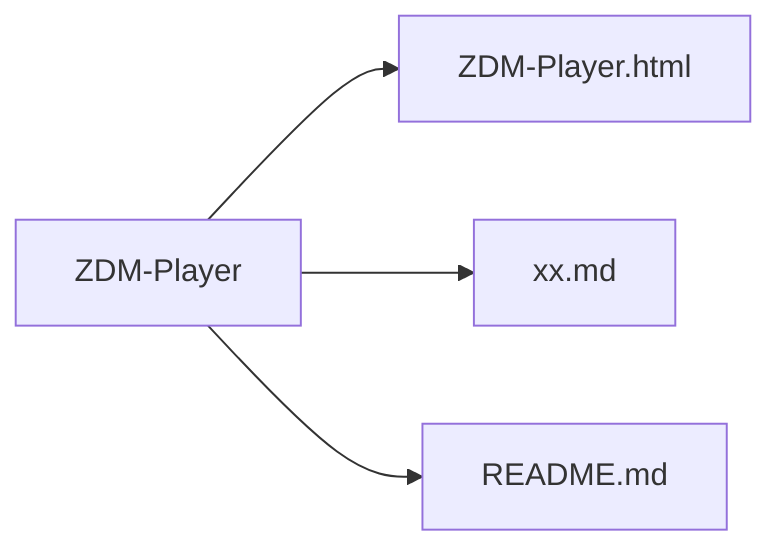

# 🎵 ZDM-Player

> 一个轻量、纯粹的 Web 音乐播放器 —— 一切尽在单个 HTML 文件。

[](LICENSE)


## 📌 项目曾用名

- `Software_Web-based-music-player`
- `Web-based-music-player`


## ✨ 功能特性

- [x] 支持本地音乐文件播放（MP3）
- [x] 播放列表
- [x] 播放控制（播放 / 暂停 / 上一首 / 下一首 / 进度拖拽）
- [x] 单 HTML 文件，无需任何依赖


## 🚀 快速开始

```bash
# 1. 克隆仓库
git clone https://github.com/Pywait/ZDM-Player.git

# 2. 进入项目目录
cd ZDM-Player/music-player

# 3. 直接用浏览器打开 index.html
start index.html   # Windows
# 或
open index.html    # macOS
# 或
xdg-open index.html # Linux
```


## 📁 项目结构

```
ZDM-Player/
├── ZDM-Player.html           # 音乐播放器主程序
├── xx.md                     # 若干文档
└── README.md
```



## 🛠️ 技术栈

- **HTML5**：页面结构
- **CSS3**：样式与动画
- **原生 JavaScript（ES6+）**：全部逻辑实现
- **Web Audio API**：音频处理与播放控制


## 📄 开源协议

本项目采用 [MIT](LICENSE) 许可证，你可以自由使用、修改和分发。